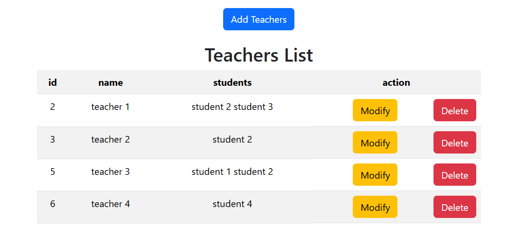

# Many-to-Many Relationship CRUD (Students & Teachers)

A simple Laravel CRUD application built to practice many-to-many relationships by managing students and teachers.

## ✨ Features

- Create students
- Read student data
- Update students
- Delete students
- Create teachers
- Read teacher data
- Update teachers
- Delete teachers
- Assign multiple teachers to a student
- Assign multiple students to a teacher
- View students with their teachers
- View teachers with their students
- Sync relationships using checkboxes
- Form validation

## 🛠 Tech Stack

**Laravel • PHP • MySQL • Bootstrap • HTML • CSS**

## 📚 What I Practiced

- Laravel routing
- Controllers
- Models
- Migrations
- CRUD operations
- Form handling and validation
- Many-to-many relationships (`belongsToMany`)
- Pivot tables
- Attaching, detaching, and syncing relationships
- Route Model Binding
- Eloquent relationships

## 📸 Screenshot

### Teachers 

### Student

